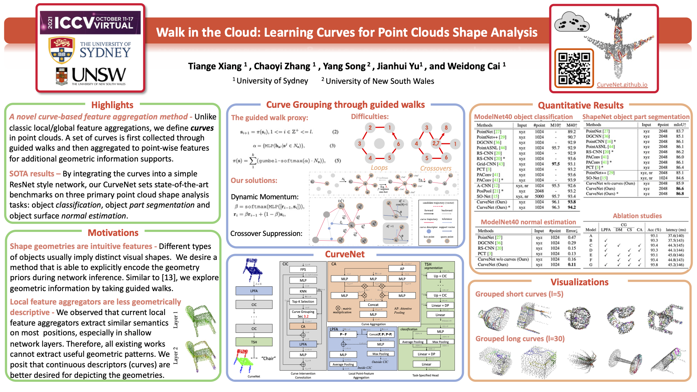

# CurveNet
Official implementation of "Walk in the Cloud: Learning Curves for Point Clouds Shape Analysis", ICCV 2021

[](https://paperswithcode.com/sota/3d-point-cloud-classification-on-modelnet40?p=walk-in-the-cloud-learning-curves-for-point)  
[](https://paperswithcode.com/sota/3d-part-segmentation-on-shapenet-part?p=walk-in-the-cloud-learning-curves-for-point)

Paper: https://arxiv.org/abs/2105.01288



## Requirements
- Python>=3.7
- PyTorch>=1.2
- Packages: glob, h5py, sklearn

## Contents
- [Point Cloud Classification](#point-cloud-classification)
- [Point Cloud Part Segmentation](#point-cloud-part-segmentation)
- [Point Cloud Normal Estimation](#point-cloud-normal-estimation)

**NOTE:** Please change your current directory to ```core/``` first before excuting the following commands.

## Point Cloud Classification
### Data

The ModelNet40 dataset is primarily used for the classification experiments. At your first run, the program will automatically download the data if it is not in ```data/```. Or, you can manually download the [offical data](https://shapenet.cs.stanford.edu/media/modelnet40_ply_hdf5_2048.zip) and unzip to ```data/```. 

Alternatively, you can place your downloaded data anywhere you like, and link the path to ```DATA_DIR``` in ```core/data.py```. Otherwise, the download will still be automatically triggered.

### Train

Train with our default settings (same as in the paper):

``` 
python3 main_cls.py --exp_name=curvenet_cls_1
```

Train with customized settings with the flags: ```--lr```, ```--scheduler```, ```--batch_size```.

Alternatively, you can directly modify ```core/start_cls.sh``` and simply run:

```
./start_cls.sh
```

**NOTE:** Our reported model achieves **93.8%/94.2%** accuracy (see sections below). However, due to randomness, the best result might require repeated training processes. Hence, we also provide another benchmark result here (where we repeated 5 runs with different random seeds, and report their average), which is **93.65%** accuracy.

<!-- **NOTE:** Due to randomness, the results could be slightly different than the one reported in our paper. We repeated 5 runs with different random seeds, and got an average of **93.65%** classification accuracy. -->

### Evaluation


Evaluate without voting:
``` 
python3 main_cls.py --exp_name=curvenet_cls_1 --eval=True --model_path=PATH_TO_YOUR_MODEL
```

Alternatively, you can directly modify ```core/test_cls.sh``` and simply run:
``` 
./test_cls.sh
```

For voting, we used the ```voting_evaluate_cls.py```script provided in [RSCNN](https://github.com/Yochengliu/Relation-Shape-CNN). Please refer to their license for usage.

### Evaluation with our pretrained model:

Please download our pretrained model ```cls/``` at [google drive](https://drive.google.com/drive/folders/1kX-zIipyzB0iMaopcijzdTRuHeTzfTSz?usp=sharing).

And then run:

``` 
python3 main_cls.py --exp_name=curvenet_cls_pretrained --eval --model_path=PATH_TO_PRETRAINED/cls/models/model.t7
```

&nbsp;
## Point Cloud Part Segmentation
### Data

The ShapeNet Part dataset is primarily used for the part segmentation experiments. At your first run, the program will automatically download the data if it is not in ```data/```. Or, you can manually download the [offical data](https://shapenet.cs.stanford.edu/media/shapenet_part_seg_hdf5_data.zip) and unzip to ```data/```. 

Alternatively, you can place your downloaded data anywhere you like, and link the path to ```DATA_DIR``` in ```core/data.py```. Otherwise, the download will still be automatically triggered.

### Train

Train with our default settings (same as in the paper):

``` 
python3 main_partseg.py --exp_name=curvenet_seg_1
```

Train with customized settings with the flags: ```--lr```, ```--scheduler```, ```--batch_size```.

Alternatively, you can directly modify ```core/start_part.sh``` and simply run:

```
./start_part.sh
```

**NOTE:** Our reported model achieves **86.6%/86.8%** mIoU (see sections below). However, due to randomness, the best result might require repeated training processes. Hence, we also provide another benchmark result here (where we repeated 5 runs with different random seeds, and report their average), which is **86.46** mIoU.

<!-- **NOTE:** Due to randomness, the results could be slightly different than the one reported in our paper. We repeated 5 runs with different random seeds, and got an average of **86.46** mIoU. -->

### Evaluation

Evaluate without voting:
``` 
python3 main_partseg.py --exp_name=curvenet_seg_1 --eval=True --model_path=PATH_TO_YOUR_MODEL
```

Alternatively, you can directly modify ```core/test_cls.sh``` and simply run:
``` 
./test_cls.sh
```

For voting, we used the ```voting_evaluate_partseg.py```script provided in [RSCNN](https://github.com/Yochengliu/Relation-Shape-CNN). Please refer to their license for usage.

### Evaluation with our pretrained model:

Please download our pretrained model ```partseg/``` at [google drive](https://drive.google.com/drive/folders/1kX-zIipyzB0iMaopcijzdTRuHeTzfTSz?usp=sharing).

And then run:

``` 
python3 main_partseg.py --exp_name=curvenet_seg_pretrained --eval=True --model_path=PATH_TO_PRETRAINED/partseg/models/model.t7
```

&nbsp;
## Point Cloud Normal Estimation

### Data

The ModelNet40 dataset is used for the normal estimation experiments. We have preprocessed the raw ModelNet40 dataset into  ```.h5``` files. Each point cloud instance contains 2048 randomly sampled points and point-to-point normal ground truths. 

Please download our processed data [here](https://drive.google.com/file/d/1j6lB3ZOF0_x_l9bqdchAxIYBi7Devie8/view?usp=sharing) and place it to ```data/```, or you need to specify the data root path in ```core/data.py```.

### Train

Train with our default settings (same as in the paper):

``` 
python3 main_normal.py --exp_name=curvenet_normal_1
```

Train with customized settings with the flags: ```--multiplier```, ```--lr```, ```--scheduler```, ```--batch_size```.

Alternatively, you can directly modify ```core/start_normal.sh``` and simply run:

```
./start_normal.sh
```

### Evaluation

Evaluate without voting:
``` 
python3 main_normal.py --exp_name=curvenet_normal_1 --eval=True --model_path=PATH_TO_YOUR_MODEL
```

Alternatively, you can directly modify ```core/test_normal.sh``` and simply run:
``` 
./test_normal.sh
```

### Evaluation with our pretrained model:

Please download our pretrained model ```normal/``` at [google drive](https://drive.google.com/drive/folders/1kX-zIipyzB0iMaopcijzdTRuHeTzfTSz?usp=sharing).

And then run:

``` 
python3 main_normal.py --exp_name=curvenet_normal_pretrained --eval=True --model_path=PATH_TO_PRETRAINED/normal/models/model.t7
```

## Citation  

If you find this repo useful in your work or research, please cite:  

```
@InProceedings{Xiang_2021_ICCV,
    author    = {Xiang, Tiange and Zhang, Chaoyi and Song, Yang and Yu, Jianhui and Cai, Weidong},
    title     = {Walk in the Cloud: Learning Curves for Point Clouds Shape Analysis},
    booktitle = {Proceedings of the IEEE/CVF International Conference on Computer Vision (ICCV)},
    month     = {October},
    year      = {2021},
    pages     = {915-924}
}
```

## Acknowledgement

Our code borrows a lot from:
- [DGCNN](https://github.com/WangYueFt/dgcnn)
- [DGCNN.pytorch](https://github.com/AnTao97/dgcnn.pytorch)
- [CloserLook3D](https://github.com/zeliu98/CloserLook3D)
