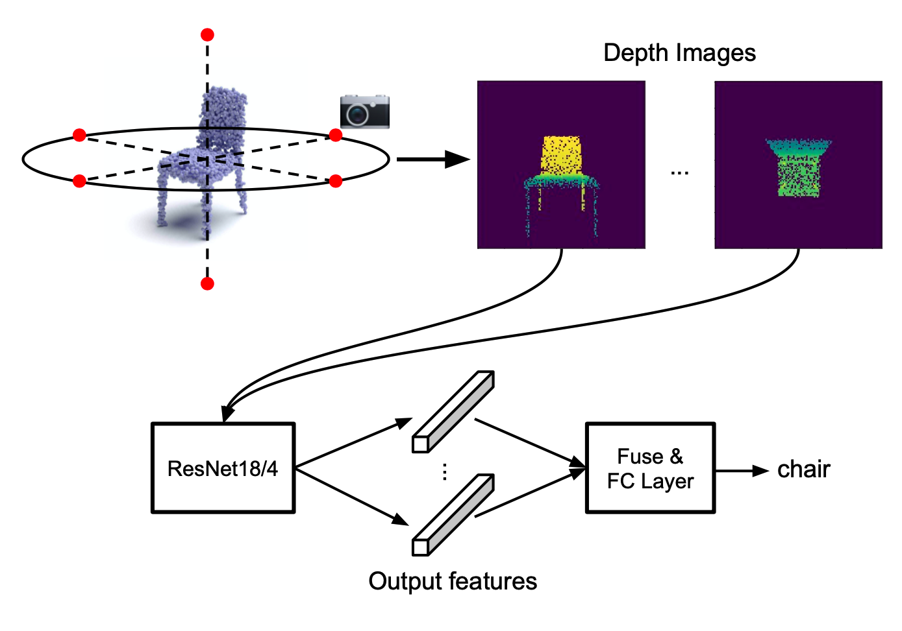

[**Revisiting Point Cloud Shape Classification with a Simple and Effective Baseline**](https://arxiv.org/pdf/2106.05304v1.pdf) <br>
[Ankit Goyal](http://imankgoyal.github.io), [Hei Law](https://heilaw.github.io/), Bowei Liu, [Alejandro Newell](https://www.alejandronewell.com/), [Jia Deng](https://www.cs.princeton.edu/~jiadeng/) <br/>
***International Conference on Machine Learning (ICML), 2021***

**Note: This contains the code for SimpleView on ScanObjectNN. It reproduces the results of Table 5 in the paper. For other experiments, please use the code [here](https://github.com/princeton-vl/SimpleView)**


If you find our work useful in your research, please consider citing:
```
@article{goyal2021revisiting,
    title={Revisiting Point Cloud Shape Classification with a Simple and Effective Baseline},
    author={Goyal, Ankit and Law, Hei and Liu, Bowei and Newell, Alejandro and Deng, Jia},
    journal={International Conference on Machine Learning},
    year={2021}
}
```

## Getting Started
We would refer to the directory containing the code as `ScanObjectNN`.

#### Requirements
The code is tested on Linux with Python version **3.7**, CUDA version **10.0**, CuDNN version **7.6** and GCC version **5.4**.

#### Install Libraries
We recommend you first install [Anaconda](https://anaconda.org/) and create a virtual environment.
```
conda create --name simpleview_sonn python=3.7
```

Activate the virtual environment and install the libraries. Make sure you are in `ScanObjectNN`.
```
conda activate simpleview_sonn
pip install -r requirements.txt
```

#### Download Datasets and Pre-trained Models
Make sure you are in `ScanObjectNN`. `download.sh` script can be used for downloading ModelNet40 and the pretrained models. It also stores them at the correct locations. 

To download ScanObjectNN, you will need to contact the authors of ScanObjectNN (mikacuy@gmail.com) to obtain a download link. After you download ScanObjectNN, unzip it under `../data`.

To download ModelNet40, run:
```
./download.sh modelnet40
```

To download the pretrained models, run:
```
./download.sh pretrained
```

## Running Experiments

#### Training and Evaluation
We provide bash scripts to train and evaluate our SimpleView model on ScanObjectNN and ModelNet40.

To train SimpleView on ScanObjectNN, run:
```
bash scripts/train_scanobjnn.sh <run>
```

To train SimpleView on ModelNet40, run:
```
bash scripts/train_modelnet.sh <run>
```

In our experiments, we do multiple runs and report the average accruacy of the model. You can train the network multiple times by substituing `<run>` with different numbers and the final model will be saved to different directories.

To evaluate SimpleView on ScanObjectNN, run:
```
bash scripts/test_scanobjnn.sh <run>
```

This will load the model from run `<run>` and evaluate it on ScanObjectNN. Due to the randomness in the ScanObjectNN data loading code, this script evaluates a run 10 times to better estimate the performance of a model.

To test the generalizability of our model, we also provide scripts for cross evaluation where we train our model on either ScanObjectNN or ModelNet40, and evaluate it on the other dataset.

To evaluate a model trained on ScanObjectNN on ModelNet40, run:
```
bash scripts/test_scanobjnn_on_modelnet40.sh <run>
```

To evaluate a model trained on ModelNet40 on ScanObjectNN, run:
```
bash scripts/test_modelnet40_on_scanobjnn.sh <run>
```

If you get the following error when you train or evaluate the model:
```
ValueError: Attr 'num_split' of 'Split' Op passed 0 less than minimum 1.
```

It means that TensforFlow cannot find the cuDNN library on your machine. You need to download the cuDNN library from NVIDIA to your machine and run the following command before running the scripts:
```
export LD_LIBRARY_PATH="${LD_LIBRARY_PATH}:/path/to/cudnn/lib64"
```


#### Evaluate a pretrained model
Pretrained models of 4 different runs can be downloaded using the `./download pretrained` command and are stored in the `log` folder. To evaluate a model, you can use the above command and replace `<run>` with a number between 1 and 4.

For example, to evaluate a model trained on ScanObjectNN from run 3 on ScanObjectNN, run:
```
bash scripts/test_scanobjnn.sh 3
```

#### Performance of the released pretrained models
<table style="border-collapse:collapse;border-spacing:0" class="tg"><thead><tr><th style="border-color:black;border-style:solid;border-width:1px;font-family:Arial, sans-serif;font-size:14px;font-weight:bold;overflow:hidden;padding:10px 5px;text-align:left;vertical-align:top;word-break:normal">Architecture</th><th style="border-color:black;border-style:solid;border-width:1px;font-family:Arial, sans-serif;font-size:14px;font-weight:bold;overflow:hidden;padding:10px 5px;text-align:center;vertical-align:top;word-break:normal">Train: ScanObjectNN<br>Test: ScanObjectNN</th><th style="border-color:black;border-style:solid;border-width:1px;font-family:Arial, sans-serif;font-size:14px;font-weight:bold;overflow:hidden;padding:10px 5px;text-align:center;vertical-align:top;word-break:normal">Train: ModelNet40<br>Test: ScanObjectNN</th><th style="border-color:black;border-style:solid;border-width:1px;font-family:Arial, sans-serif;font-size:14px;font-weight:bold;overflow:hidden;padding:10px 5px;text-align:center;vertical-align:top;word-break:normal">Train: ScanObjectNN<br>Test: ModelNet40</th></tr></thead><tbody><tr><td style="border-color:inherit;border-style:solid;border-width:1px;font-family:Arial, sans-serif;font-size:14px;overflow:hidden;padding:10px 5px;text-align:left;vertical-align:top;word-break:normal">3DmFV</td><td style="border-color:inherit;border-style:solid;border-width:1px;font-family:Arial, sans-serif;font-size:14px;overflow:hidden;padding:10px 5px;text-align:center;vertical-align:top;word-break:normal">63.0</td><td style="border-color:inherit;border-style:solid;border-width:1px;font-family:Arial, sans-serif;font-size:14px;overflow:hidden;padding:10px 5px;text-align:center;vertical-align:top;word-break:normal">24.9</td><td style="border-color:inherit;border-style:solid;border-width:1px;font-family:Arial, sans-serif;font-size:14px;overflow:hidden;padding:10px 5px;text-align:center;vertical-align:top;word-break:normal">51.5</td></tr><tr><td style="border-color:inherit;border-style:solid;border-width:1px;font-family:Arial, sans-serif;font-size:14px;overflow:hidden;padding:10px 5px;text-align:left;vertical-align:top;word-break:normal">PointNet</td><td style="border-color:inherit;border-style:solid;border-width:1px;font-family:Arial, sans-serif;font-size:14px;overflow:hidden;padding:10px 5px;text-align:center;vertical-align:top;word-break:normal">68.2</td><td style="border-color:inherit;border-style:solid;border-width:1px;font-family:Arial, sans-serif;font-size:14px;overflow:hidden;padding:10px 5px;text-align:center;vertical-align:top;word-break:normal">31.1</td><td style="border-color:inherit;border-style:solid;border-width:1px;font-family:Arial, sans-serif;font-size:14px;overflow:hidden;padding:10px 5px;text-align:center;vertical-align:top;word-break:normal">50.9</td></tr><tr><td style="border-color:inherit;border-style:solid;border-width:1px;font-family:Arial, sans-serif;font-size:14px;overflow:hidden;padding:10px 5px;text-align:left;vertical-align:top;word-break:normal">SpiderCNN</td><td style="border-color:inherit;border-style:solid;border-width:1px;font-family:Arial, sans-serif;font-size:14px;overflow:hidden;padding:10px 5px;text-align:center;vertical-align:top;word-break:normal">73.7</td><td style="border-color:inherit;border-style:solid;border-width:1px;font-family:Arial, sans-serif;font-size:14px;overflow:hidden;padding:10px 5px;text-align:center;vertical-align:top;word-break:normal">30.9</td><td style="border-color:inherit;border-style:solid;border-width:1px;font-family:Arial, sans-serif;font-size:14px;overflow:hidden;padding:10px 5px;text-align:center;vertical-align:top;word-break:normal">46.6</td></tr><tr><td style="border-color:inherit;border-style:solid;border-width:1px;font-family:Arial, sans-serif;font-size:14px;overflow:hidden;padding:10px 5px;text-align:left;vertical-align:top;word-break:normal">PointNet++</td><td style="border-color:inherit;border-style:solid;border-width:1px;font-family:Arial, sans-serif;font-size:14px;overflow:hidden;padding:10px 5px;text-align:center;vertical-align:top;word-break:normal">77.9</td><td style="border-color:inherit;border-style:solid;border-width:1px;font-family:Arial, sans-serif;font-size:14px;overflow:hidden;padding:10px 5px;text-align:center;vertical-align:top;word-break:normal">32.0</td><td style="border-color:inherit;border-style:solid;border-width:1px;font-family:Arial, sans-serif;font-size:14px;overflow:hidden;padding:10px 5px;text-align:center;vertical-align:top;word-break:normal">47.4</td></tr><tr><td style="border-color:inherit;border-style:solid;border-width:1px;font-family:Arial, sans-serif;font-size:14px;overflow:hidden;padding:10px 5px;text-align:left;vertical-align:top;word-break:normal">DGCNN</td><td style="border-color:inherit;border-style:solid;border-width:1px;font-family:Arial, sans-serif;font-size:14px;overflow:hidden;padding:10px 5px;text-align:center;vertical-align:top;word-break:normal">78.1</td><td style="border-color:inherit;border-style:solid;border-width:1px;font-family:Arial, sans-serif;font-size:14px;overflow:hidden;padding:10px 5px;text-align:center;vertical-align:top;word-break:normal">36.8</td><td style="border-color:inherit;border-style:solid;border-width:1px;font-family:Arial, sans-serif;font-size:14px;overflow:hidden;padding:10px 5px;text-align:center;vertical-align:top;word-break:normal">54.7</td></tr><tr><td style="border-color:inherit;border-style:solid;border-width:1px;font-family:Arial, sans-serif;font-size:14px;overflow:hidden;padding:10px 5px;text-align:left;vertical-align:top;word-break:normal">PointCNN</td><td style="border-color:inherit;border-style:solid;border-width:1px;font-family:Arial, sans-serif;font-size:14px;overflow:hidden;padding:10px 5px;text-align:center;vertical-align:top;word-break:normal">78.5</td><td style="border-color:inherit;border-style:solid;border-width:1px;font-family:Arial, sans-serif;font-size:14px;overflow:hidden;padding:10px 5px;text-align:center;vertical-align:top;word-break:normal">24.6</td><td style="border-color:inherit;border-style:solid;border-width:1px;font-family:Arial, sans-serif;font-size:14px;overflow:hidden;padding:10px 5px;text-align:center;vertical-align:top;word-break:normal">49.2</td></tr><tr><td style="border-color:inherit;border-style:solid;border-width:1px;font-family:Arial, sans-serif;font-size:14px;overflow:hidden;padding:10px 5px;text-align:left;vertical-align:top;word-break:normal">SimpleView</td><td style="border-color:inherit;border-style:solid;border-width:1px;font-family:Arial, sans-serif;font-size:14px;overflow:hidden;padding:10px 5px;text-align:center;vertical-align:top;word-break:normal">79.5 +/- 0.5</td><td style="border-color:inherit;border-style:solid;border-width:1px;font-family:Arial, sans-serif;font-size:14px;overflow:hidden;padding:10px 5px;text-align:center;vertical-align:top;word-break:normal">40.5 +/- 1.4</td><td style="border-color:inherit;border-style:solid;border-width:1px;font-family:Arial, sans-serif;font-size:14px;overflow:hidden;padding:10px 5px;text-align:center;vertical-align:top;word-break:normal">57.9 +/- 2.1</td></tr></tbody></table>

## Acknowlegements
We would like to thank the authors of the following reposities for sharing their code.
- Revisiting Point Cloud Classification: A New Benchmark Dataset and Classification Model on Real-World Data: [1](https://github.com/hkust-vgd/scanobjectnn.git)
